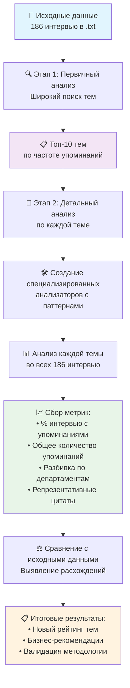

# 🔄 Краткая схема Data Pipeline

## 📊 Визуальная схема процесса



## 🎯 Ключевые этапы

### 1️⃣ **INPUT** - Исходные данные
- 📁 186 файлов интервью (.txt)
- 🏢 5 департаментов 
- 🌍 5 языков

### 2️⃣ **BROAD ANALYSIS** - Широкий анализ
- 🔍 Семантический поиск по всем файлам
- 📊 Выявление топ-10 тем
- 📈 Первичная статистика

### 3️⃣ **DEEP DIVE** - Глубокий анализ
- 🎯 Создание 10 специализированных анализаторов
- 🔬 Детальный поиск по паттернам
- 📋 Сбор контекста и цитат

### 4️⃣ **VALIDATION** - Валидация
- ⚖️ Сравнение с исходными данными
- 📊 Выявление расхождений до -74.9%
- 🔄 Пересортировка рейтинга

### 5️⃣ **OUTPUT** - Результаты
- 📁 13 JSON файлов с анализом
- 📈 Новый рейтинг тем по важности
- 💼 Бизнес-рекомендации

## 🛠️ Технический стек

```
Python 3 + регулярные выражения
├── re (поиск паттернов)
├── json (структурирование данных)  
├── pathlib (работа с файлами)
└── typing (типизация)
```

## 📊 Ключевые метрики

| Метрика | Описание | Пример |
|---------|----------|--------|
| **% интервью** | Доля интервью с упоминаниями | 10.8% для зарплаты |
| **Всего упоминаний** | Общее количество | 32 упоминания |
| **Расхождение** | Разница с исходными данными | -74.9% |
| **Департаменты** | Распределение по подразделениям | Юмашева: 11, Щербакова: 8 |

## 🎯 Главные открытия

### 🔴 Самые переоцененные темы:
1. **Задержки зарплаты**: 85.7% → 10.8% (-74.9%)
2. **Условия труда**: 73.6% → 25.8% (-47.8%)

### 🟢 Самые недооцененные темы:
1. **Развитие и карьера**: 24.7% → 62.4% (+37.7%)
2. **Руководство**: 47.8% → 72.6% (+24.8%)

## 🚀 Применение в новых проектах

1. **Адаптировать паттерны** под новую предметную область
2. **Настроить метаданные** (департаменты, языки)
3. **Запустить пайплайн** на новых данных
4. **Валидировать результаты** на выборке

---

*Полная документация в файле `DATA_ANALYSIS_PIPELINE.md`*
